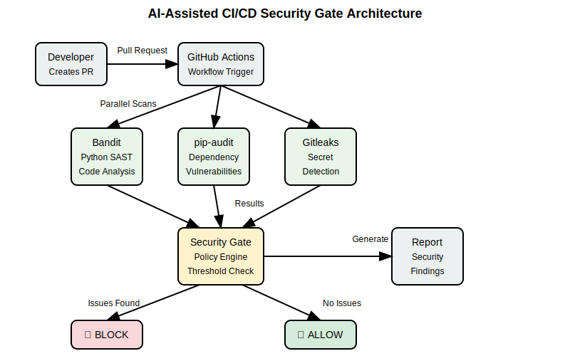
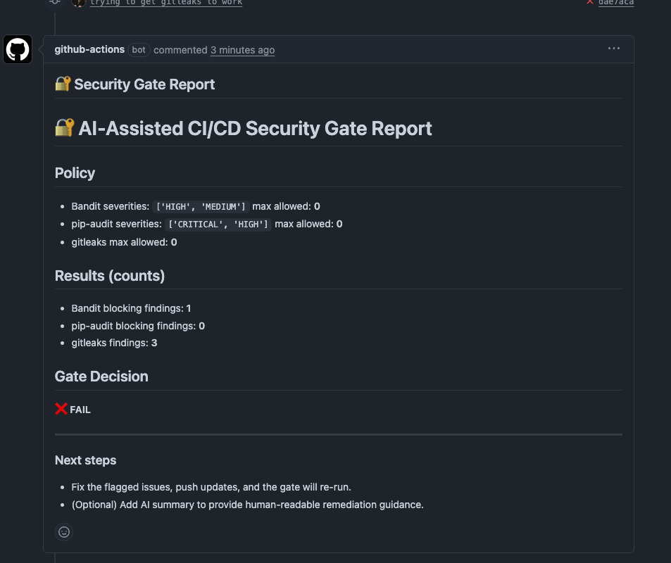

# AI-Assisted CI/CD Security Gate

A comprehensive security scanning pipeline that automatically detects vulnerabilities in Python code, dependencies, and secrets before allowing code merges.



## 🔧 Features

- **SAST (Static Application Security Testing)** - Bandit scans Python code for security vulnerabilities
- **SCA (Software Composition Analysis)** - pip-audit checks dependencies for known CVEs  
- **Secrets Detection** - Gitleaks scans for exposed credentials and API keys
- **Policy Enforcement** - Configurable thresholds block merges when issues are found
- **Automated Reporting** - Detailed security reports posted as PR comments

## 🚀 Demo

This repository contains intentional security vulnerabilities to demonstrate the security gate:

- `bad.py` - Contains unsafe pickle deserialization (MEDIUM severity)
- `secrets.txt` - Contains exposed API keys and tokens

## 📋 How It Works

1. **Trigger**: Pull requests to `main` branch automatically trigger security scans
2. **Scan**: Three security tools run in parallel:
   - Bandit (Python SAST)
   - pip-audit (Dependency vulnerabilities) 
   - Gitleaks (Secret detection)
3. **Gate**: Policy engine evaluates findings against configured thresholds
4. **Block**: Merge is blocked if security issues exceed policy limits
5. **Report**: Detailed findings posted as PR comment




## 🔍 Try It Yourself

1. Fork this repository
2. Create a pull request with the existing vulnerable code
3. Watch the security gate detect issues and block the merge
4. Fix the vulnerabilities and see the gate pass

## 📸 Portfolio Demo

**Current Status**: This repository has an open PR demonstrating the security gate in action:
- PR shows **FAILED** security gate blocking merge
- Security report identifies specific vulnerabilities
- Demonstrates real-world security automation

**To see it working**:
1. View the open pull request
2. Check the failed GitHub Actions workflow
3. Review the security gate report artifact
4. See how merge is blocked until issues are fixed

## 📊 Policy Configuration

Security thresholds are defined in `policy/gate.yml`:

```yaml
fail_on:
  bandit:
    severities: ["HIGH", "MEDIUM"]
    max_allowed: 0
  pip_audit:
    severities: ["CRITICAL", "HIGH"] 
    max_allowed: 0
  gitleaks:
    max_allowed: 0
```

## 🛠️ Technologies Used

- **GitHub Actions** - CI/CD pipeline automation
- **Python** - Gate logic and reporting
- **Bandit** - Python security linter
- **pip-audit** - Python dependency vulnerability scanner
- **Gitleaks** - Secret detection tool
- **YAML** - Configuration and workflow definitions

## 📈 Results

The security gate successfully:
- ✅ Detects code vulnerabilities (pickle deserialization)
- ✅ Finds exposed secrets (API keys, tokens)
- ✅ Blocks unsafe code from being merged
- ✅ Provides actionable security reports
- ✅ Integrates seamlessly with GitHub workflow

---

*This project demonstrates implementing security-first DevOps practices with automated vulnerability detection and policy enforcement.*